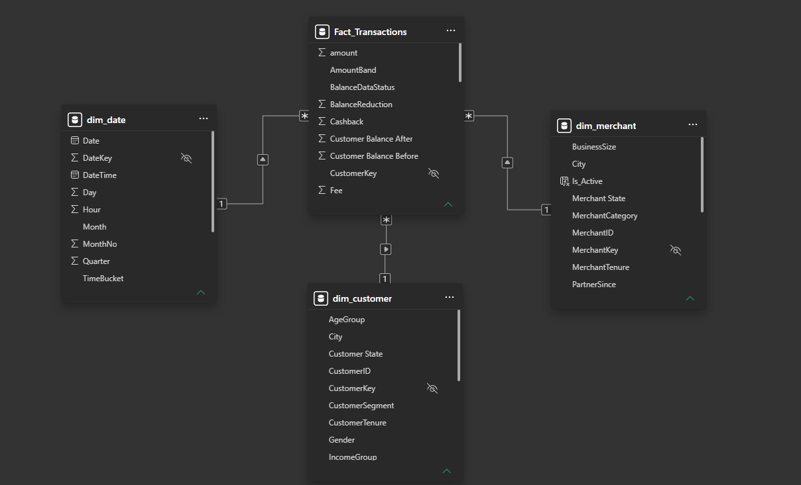
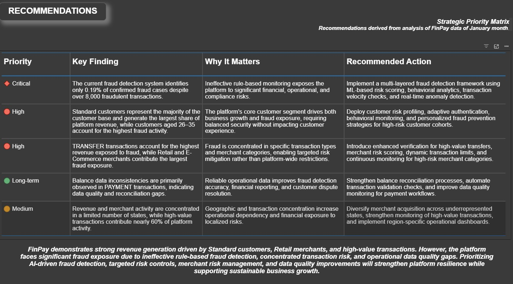

# FinPay Analytics | End-to-End Business Intelligence Project

> An end-to-end Business Intelligence solution for a digital payments platform, built using Python, Microsoft SQL Server, and Power BI.

##  Project Overview

FinPay Analytics is an end-to-end Business Intelligence project that simulates the analytics workflow of a modern fintech company.

Starting with a real-world transaction dataset, the project demonstrates the complete BI lifecycle:

- Data Engineering using Python
- Star Schema Data Modeling
- SQL Data Validation & Business Analysis
- Interactive Power BI Dashboards
- Executive Business Recommendations

The objective is to transform raw transactional data into meaningful business insights that help stakeholders monitor revenue, customer behaviour, merchant performance, and fraud exposure.

# Tech Stack

| Technology | Purpose |
|------------|---------|
| Python (Pandas, NumPy) | Data Cleaning & Feature Engineering |
| Microsoft SQL Server (T-SQL) | Database Design & Business Analysis |
| Power BI | Dashboard Development |
| Power Query | Data Transformation |
| DAX | KPI & Measure Creation |
| Git & GitHub | Version Control |

# Dataset

Source Dataset

**Kaggle - PaySim Mobile Money Transactions Dataset**

Original Dataset Size

- 6.3 Million Transactions

Project Dataset

- 60,000 Transactions

Synthetic dimensions were created to simulate a realistic fintech business environment.

# Data Engineering

The original dataset only contained transaction records.

To support dimensional modelling and business analysis, several synthetic dimensions and business features were engineered using Python.

## Customer Dimension

Created synthetic customer profiles including:

- Customer Segment
- Gender
- Age
- Age Group
- Income Group
- State
- City
- KYC Status
- Join Year
- Customer Tenure
- Active Status

## Merchant Dimension

Generated merchant information including:

- Merchant Category
- Business Size
- Settlement Cycle
- Merchant State
- Merchant City
- Merchant Tenure
- Partner Since

## Date Dimension

Created a complete Date Dimension with

- Date
- Day
- Month
- Quarter
- Year
- Hour
- Time Bucket

## Additional Business Features

Feature engineering included

- Fee
- Cashback
- Net Revenue
- Amount Band
- High Value Transaction
- Balance Reduction
- Balance Data Status

These engineered features enabled richer business analysis and KPI generation.

# Data Model

---

# 📈 Dashboards

## 1. Executive Summary

## 2. Customer Analytics

## 3. Merchant Analytics

## 4. Fraud Analytics

## 5. Recommendations

# 📌 Key Business Insights

### Executive

- Very Large transactions contribute nearly 60% of total platform activity.
- Revenue generation is concentrated across a limited number of merchant states.
- PAYMENT transactions exhibit the highest number of incomplete balance records.

### Customer

- Standard customers contribute the largest share of platform revenue.
- Middle-income customers represent over 50% of the customer base.
- Customers aged 26–35 years form the largest user segment.

### Merchant

- Retail merchants generate the highest revenue.
- Enterprise merchants consistently outperform Small and Medium businesses.
- Nearly 70% of merchants operate on a T+1 settlement cycle.

### Fraud

- Transfer transactions contribute the highest fraud exposure.
- Retail and E-Commerce merchants account for the majority of fraud losses.
- The rule-based fraud detection system identifies only 0.19% of confirmed fraud cases.

# Business Recommendations

- Implement AI-based fraud detection using behavioural analytics.
- Introduce enhanced verification for high-value transfer transactions.
- Strengthen merchant risk scoring for Retail and E-Commerce categories.
- Improve balance reconciliation to reduce incomplete transaction records.
- Expand merchant acquisition across underrepresented states.

# SQL Highlights

The project includes SQL scripts covering

- Database Creation
- Star Schema Design
- Data Validation
- Exploratory Analysis
- Customer Analytics
- Merchant Analytics
- Fraud Analytics
- Views
- Window Functions
- CTEs

# Power BI Features

- Interactive Slicers
- Dynamic KPIs
- Drill-through Analysis
- Geographic Mapping
- Conditional Formatting
- Custom DAX Measures
- Cross Filtering

# Skills Demonstrated

- Data Cleaning
- Data Engineering
- Feature Engineering
- Dimensional Modelling
- SQL
- Power Query
- DAX
- Business Intelligence
- Dashboard Design
- Data Storytelling
- Business Analytics

# Business Impact

This project demonstrates how transactional data can be transformed into actionable insights that support

- Executive Decision Making
- Customer Segmentation
- Merchant Performance Monitoring
- Fraud Risk Management
- Operational Efficiency

